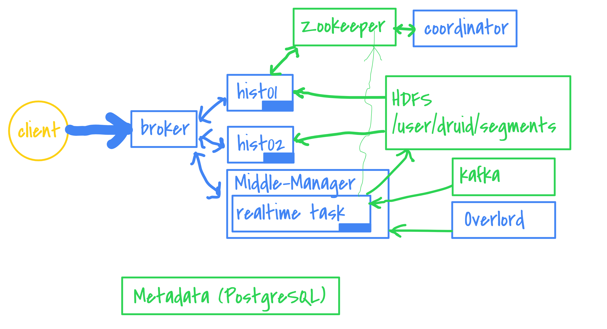

# Druid technical overview

---

### Show me

- Timeseries database
- Columnar storage: immutable "segments" files
- Horizontal scaling
- Rollup (optional now)

---

### Nodes

- Broker(s): query
- Historical(s): query |
- Coordinator(s): manage data location |
- Overlord(s): task endpoint |
  - Middle-Manager(s): manage workers |
    - Peon: work !|
      - Task: realtime query |
- RealTime: legacy |

+++



---

### External dependencies

- Deep Storage: local, HDFS, S3, GCS...
- Metadata Storage (MySQL/PostgreSQL): config, datasources, rules, segments, supervisors, tasks
- Zookeeper: communication between nodes (zknodes subscription)

- Hadoop/Yarn: reprocess large segments (merge, compact, remove column etc.)

---

### Broker

- Parse the query
- Look at the metadata to know where are the data
- Can cache results (local, memcached, redis...)

- Routers: broker of brokers (query isolation)

---

### Historical

- Load data from Deep Storage on its disk when asked (Coordinator)
- Can cache results (local, memcached, redis...)
- Replication

---

### Coordinator

- Rules: 1d, 30d, forever (load or drop)
- Tiers
  - hot: SSDs, recent data
  - cold: HDDs, old stuff
  - Different business domains
- Replication
- Load distribution on historical nodes (f(resoures))

---

### APIs

- REST everywhere

+++

#### Monitoring

http://node:port/status

```
{
  "version": "0.9.2",
  "modules": [{
    "name": "com.powerspace.druid.avro.PwsDruidModule"
  }, {
    "name": "io.druid.storage.hdfs.HdfsStorageDruidModule",
    "artifact": "druid-hdfs-storage",
    "version": "0.9.2"
  }, ...  ],
  "memory": {
    "maxMemory": 25125584896,
    "totalMemory": 25125584896,
    "freeMemory": 22389509576,
    "usedMemory": 2736075320
  }
}
```

---

### Ingestion

+++

#### Streaming

- Kafka Supervisor
  - Indexing Service = Overlord + MM
  - JSON spec to the Overlord to create ingestion tasks.
  - `http://overlord:8081/druid/indexer/v1/supervisor`
  - Can be reset
- Tranquility |
  - Start a task
  - "push" to a HTTP endpoint on the task
- Handoff: to Deep Storage (ask Coordinator) |

+++

#### Ingestion spec

- Data format? (json, avro, parquet...)
- Which column is the time?
- Which are the dimensions?

```json
"dataSchema": {
  "dataSource": "mydata",
  "parser": {
    "type": "string",
    "parseSpec": {
      "format": "json",
      "timestampSpec": { "column": "ts", "format": "auto" },
      "dimensionsSpec": {
        "dimensions": [ "user_id", "campaign_id" ],
      }
    }
  },
  ...
```

+++

- Which metrics to aggregate?
- What granularity? (query, storage) = f(granularity)

```json
  ...
  "metricsSpec": [
    { "type": "count", "name": "count" },
    { "type": "doubleSum", "name": "cpc", "fieldName": "cpc" }
  ],
  "granularitySpec": {
    "type": "uniform",
    "segmentGranularity": "DAY",
    "queryGranularity": "HOUR"
  }
}
```

+++

- Where are the data?

#### Kafka Supervisor

```json
"ioConfig": {
  "topic": "transactions",
  "consumerProperties": {
    "bootstrap.servers": "broker:9092",
    "group.id": "druid-supervisor-transactions"
  }
}
```

+++

- Where are the data?

#### Batch

- Submit `index` or `index_hadoop` tasks
- CLI: `java ... io.druid.cli.Main index hadoop <spec_file>`

+++

- Layout: static files, hierarchy...
- Format: CSV, JSON, Avro, Parquet...
- Can read Druid datasources too!

```json
"ioConfig": {
  "type": "hadoop",
  "inputSpec": {
    "type": "granularity",
    "inputFormat": "io.druid.data.input.parquet.DruidParquetInputFormat",
    "dataGranularity": "hour",
    "inputPath": "/data/transactions_partitioned",
    "pathFormat": "'ymd'=yyyy-MM-dd/'h'=H",
    "filePattern": ".*\\.parq"
  },
```

+++

#### Reindexing

- Segments are immutables
- Versioning: "just expose the latest"

eg: Every day: reindex the previous day with a larger granularity (size--)

---

### Extensions

+++

- Custom Aggregator
- Custom Data format (avro, parquet, orc...)

+++

- Service Provider API
- Create a module

```
$ cat src\main\resources\META-INF\services\io.druid.initialization.DruidModule
com.powerspace.druid.PwsDruidModule
$ cat src\main\java\com\powerspace\druid\avro\PwsDruidModule.java
...
new SimpleModule("PwsDruidModule")
 .registerSubtypes(new NamedType(PwsInputRowParser.class, "pws-druid"))
```

+++

- Package and copy

  - `druid/extensions/pws/pws-druid-1.8.jar`

+++

- Ask politely to Druid
  - `_common/common.runtime.properties`:

```
druid.extensions.loadList=[... "pws-druid"]
```

---

### Queries

- Brokers
- Historicals (standalone or via broker)
- Realtime tasks (standalone or via broker)

+++

#### Classic

Aggregated:
- timeseries
- topN
- groupBy (v1 and v2)

Non aggregated:
- select: raw data, paging
- search: dimensions that match filters

+++

- Computed columns
```json
"dimensions": [{
  "type": "extraction",
  "extractionFn": { "type": "substring", "index": 0, "length": 1 },
  "dimension": "lastname",
  "outputName": "lastname_partition"
}],
```
- Regex matching, time format, string format
- JavaScript functions


+++

#### Metadata

- dataSourceMetadata
- timeBoundary
- segmentMetadata

+++

#### Aggregations

- Post-aggregations: computed aggregate from aggregations

Classics
- count, sum, min, max, first, last
- JavaScript functions (reduce)

+++

#### Aggregations

Probabilistics
- `cardinality` (hll)
- `hyperUnique` (hll)
- `thetaSketch` (datasketches)

+++

eg: Count per day

```shell
$ curl -X POST "http://broker:8082/druid/v2/?pretty"
       -H 'content-type: application/json' -d@query.json
```

+++

eg: Count per day

query.json
```json
{"queryType":"timeseries",
 "dataSource":"mydata",
 "aggregations":[{ "type":"longSum", "name":"count"," fieldName ":"count" }],
 "granularity":"day",
 "intervals": [ "2001-01-01/2100-01-01" ] }
```
response
```json
{ "version" : "v1",                        
  "timestamp" : "2016-03-20T16:45:00.000Z",
  "event" : { "count" : 718 } },
{ "version" : "v1",                        
  "timestamp" : "2016-03-20T18:45:00.000Z",
  "event" : { "count" : 718 } },
...
```

---

#### Lookups

- ~Joins on dimension tables
- Use another DB to get the name from the ID
- Lookups are in-memory maps (regular fetch)

+++

```json
"campaign_id": {
  "type": "cachedNamespace",
  "extractionNamespace": {
    "type": "jdbc",
    "connectorConfig": {
      "connectURI": "jdbc:postgresql://postgresql:5432/db",
      "user": "admin", "password": "admin"
    },
    "table": "campaigns",
    "keyColumn": "id",
    "valueColumn": "name"
  },
  "pollPeriod": "PT5M"
}
```

---

#### Endpoints

- JSON
- SQL (since Druid 0.10)
  - Before we could use PlyQL (SQL -> JSON)

---

### How queries work

- Broker --> Historicals + Realtime tasks --> Merge into broker
- Scatter + Gather
- Caching

+++

#### query = f(ingestion_spec)

- We can't query what we didn't indexed |
- Some type of aggregations in queries must have their column properly indexed first: |
  - `thetaSketch` aggregation in query works only if the column was aggregated as `thetaSketch`
    - Fast cardinality result but takes space

---

### Tasks

- `index` or `index_hadoop`
- Merge, append segments
- Kill (delete segments)
- Convert (dimension compression, bitmap..)

---

### Segments

- 1 interval = N segments
- Partitioning (size, count)
- Must be &lt; 700MB
- Not too many

```
...
hdfs:///druid/segments/mydata/20171208TZ_20171209Z/2017-12-08T00_00_00.468Z/38/index.zip
hdfs:///druid/segments/mydata/20171208TZ_20171209Z/2017-12-08T00_00_00.468Z/39/index.zip
...
hdfs:///druid/segments/mydata/<interval>/<version>/<shard>/index.zip
```

+++

- Manual insertion (from backup)
  - `io.druid.cli.Main tools insert-segment --workingDir hdfs://host:port/druid`

---

### Metrics

- Graphite, kafka, anywhere

---

### Tooling

- Imply platform $$$
- Pivot

- Metabase
- Apache Superset (Panoramix/Caravel)

+++

### Internal UIs

- http://coordinator:8081/#/: datasources, intervals, segments, distribution
- http://coordinator:8081/old-console/: REST calls via simple forms
- http://coordinator:8081/old-console/cluster.html: nodes occupation, list of segments

---

## More and more

- Spark: https://github.com/metamx/druid-spark-batch (indexing part, no more MR)
- Hive
```sql
CREATE EXTERNAL TABLE druid_table
STORED BY 'org.apache.hadoop.hive.druid.DruidStorageHandler'
TBLPROPERTIES ("druid.datasource" = "mydata");
```
- Looker


---

## No question, go to work
